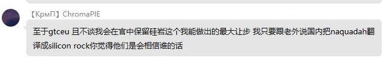

# NaquadahFix
将纳夸达替换为纳卡达的资源包  
仅限1.12.2 没做1.16.5的  
某些激进派不是喜欢乱改译名还改不对吗？这有个够对的，这音直接从阿拉伯语考来，比《星际之门》官方剧集对多了
另：感谢这位阿拉伯语学生，今天的事有劳你了

主要由 Cyl18 使用 `git diff 585c9dd 20a5693 | grep "^+"` 生成
WuzgXY 替换

---

